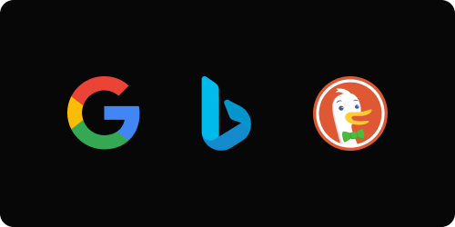
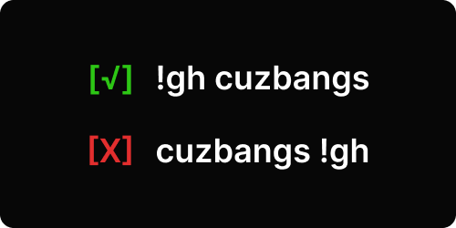
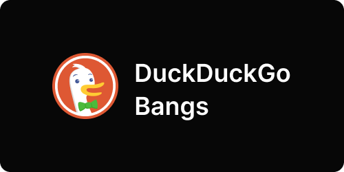
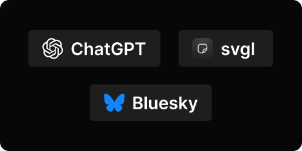

# cuzbangs

Tired with being forced? Search for anything you want with your chosen search engine. Don't like "!" mark? change it. Add this to your browser as default search engine. Don't forget, cuzbangs, cuz it bangs.

[cuzbangs.vercel.app](https://cuzbangs.vercel.app)

## Search with your search engine preferences


Don't like Google? use Bing. Wanna more privacy? use DuckDuckGo. or something else?? you can add search engine yourself.

## Custom symbol to call bangs


The default is !bangs, but you can change it with @bangs, #bangs, $bangs, or .bangs, choose whatever you like.

## Force bangs call on first place


Force your bang call to appear at the very beginning of the query:

```bash
!g what is cat?
```

Regardless of extra words before the symbol, cuzbangs will move the bang to the front so your intended site gets the query first.

## Use DuckDuckGo bangs presets


Leverage the extensive [DuckDuckGo](https://duckduckgo.com/bangs) bang catalog out-of-the-box. Every one of their thousands of bangs works here, no setup needed.

## Custom bangs


Need something niche? Create your own bangs to hit any site. Your custom definitions always take priority over the DuckDuckGo list when a clash happens.

